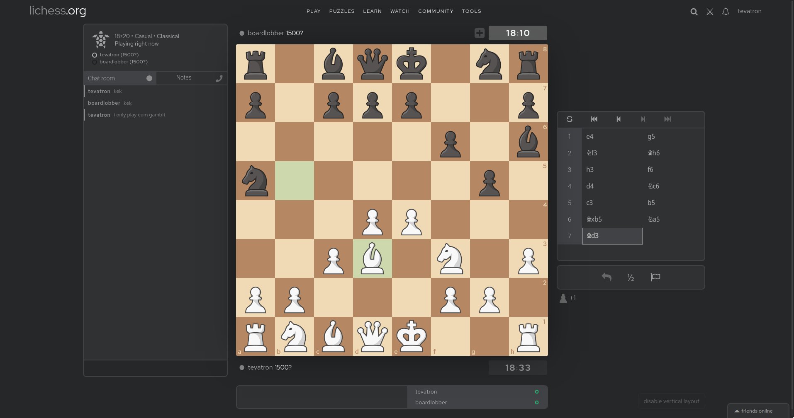

# Lichess Custom Pieces
Use custom pieces on [Lichess](https://lichess.org), with Chrome extension [Stylus](https://chrome.google.com/webstore/detail/stylus/clngdbkpkpeebahjckkjfobafhncgmne?hl=en)



My Lichess setup with Chess.com pieces and styled with [Prettier Lichess](https://chrome.google.com/webstore/detail/prettier-lichess/epgnobcgnmchnhgkgpedebbmhbblfcob).

## Instructions
1. Install browser extension [Stylus](https://chrome.google.com/webstore/detail/stylus/clngdbkpkpeebahjckkjfobafhncgmne?hl=en), or any other extension that can override a website's CSS.
2. In the Stylus dashboard, create a new style and paste the following template into it

```css
/* Black Pieces */

.is2d .black.pawn {
  background-image: url("");
}

.is2d .black.knight {
  background-image: url("");
}

.is2d .black.bishop {
  background-image: url("");
}

.is2d .black.rook {
  background-image: url("");
}

.is2d .black.queen {
  background-image: url("");
}

.is2d .black.king {
  background-image: url("");
}

/* White Pieces */

.is2d .white.pawn {
  background-image: url("");
}

.is2d .white.knight {
  background-image: url("");
}

.is2d .white.bishop {
  background-image: url("");
}

.is2d .white.rook {
  background-image: url("");
}

.is2d .white.queen {
  background-image: url("");
}

.is2d .white.king {
  background-image: url("");
}
```

4. Convert all of your pieces to Base64 with an [Image to Base64 Converter](https://base64.guru/converter/encode/image). Make sure to select `Data URI -- data:content/type;base64` as Output Format. Here are the **[Chess.com pieces](chessdotcom.css)** that I use.
5. Insert the output into the `background-image: url("data:image/png;base64, ... ")`  field for each piece.
6. Save the newly created style and admire your pieces on Lichess.


